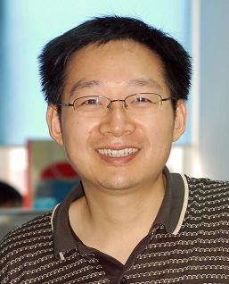

title: Feng Xu

    
<!-- row -->
        

            
        

        

            
<!-- nesting row -->
                

                    <h1>徐 锋</h1>
                

                

                    <h1>Feng Xu</h1>
                

            
<!-- nesting row end -->
            
<!-- nesting row -->
                

                    博士，教授（博导）
                

                

                    Ph.D., Professor
                

            
<!-- nesting row end -->
            
<!-- nesting row -->
                

                    南京大学计算机科学与技术系
                

                

                    Department of Computer Science and Technology, Nanjing University
                

            
<!-- nesting row end -->
            
<!-- nesting row -->
                

                    南京市栖霞区仙林大道163号
                

                

                    163# Xianlin Road, Nanjing 210023, Jiangsu, China
                

            
<!-- nesting row end -->
            
<!-- nesting row -->
                

                计算机系楼817
                

                

                Computer Building 817
                

            
<!-- nesting row end -->
            
<!-- nesting row -->
                

                    E-mail: </img>
                

            
<!-- nesting row end -->
            
<!-- nesting row -->
                

                    Tel: +86 +25 83686590
                

            
<!-- nesting row end -->
        

    
<!-- row end -->

## Research interests

* Software Defect Localization
* Data Mining
* Recommender Systems
* Trust Management

## Some recent publications

   * Xiaoyu Chen, Yuan Yao, *Feng Xu*, Jian Lu, Exploring Review Content for Recommendation via Latent Factor Model, PRICAI'14 (The 13th Pacific Rim International Conference on Artificial Intelligence), 1 - 5 December, 2014, Gold Coast, Australia.
   * Yuan Yao, Hanghang Tong, Guo Yan, *Feng Xu*, Xiang Zhang, Boleslaw Szymanski, Jian Lu, Dual-Regularized One-Class Collaborative Filtering, CIKM'14 (The 23rd ACM International Conference on Information and Knowledge Management), 3 - 7 November, 2014, Shanghai, China.
   * Yuan Yao, Hanghang Tong, *Feng Xu*, Jian Lu, Predicting Long-Term Impact of CQA Posts: A Comprehensive Viewpoint, KDD'14 (The 20th ACM SIGKDD Conference on Knowledge Discovery and Data Mining), 24 - 27 August, 2014, New York, USA. (acceptance rate 14.6% )
   * Yuan Yao, Hanghang Tong, Xifeng Yan, *Feng Xu*, Jian Lu, Multi-Aspect+ Transitivity+ Bias: An Integral Trust Inference Model, IEEE Transactions on Knowledge and Data Engineering, 26(7), 2014.
   * Yuan Yao, Hanghang Tong, Xifeng Yan, *Feng Xu*, Jian Lu, MATRI: A Multi-Aspect and Transitive Trust Inference Model, WWW'13 (The 22nd International World Wide Web Conference), 13 - 17 May, 2013, Rio de Janeiro, Brazil. (acceptance rate 15% )
   * Yuan Yao, *Feng Xu*, Yongli Ren, Hanghang Tong, Jian Lu, SelfTrust: Leveraging Self-Assessment for Trust Inference in Internetware, SCIENCE CHINA Information Sciences, 56(10), 2013.

(<a href="publications">A full list...</a>)

## Teaching

* 2010-2015, Spring: Operating System

## Awards

* 2006: 国家科技进步二等奖
* 2010: 教育部高校优秀科研成果技术发明一等奖