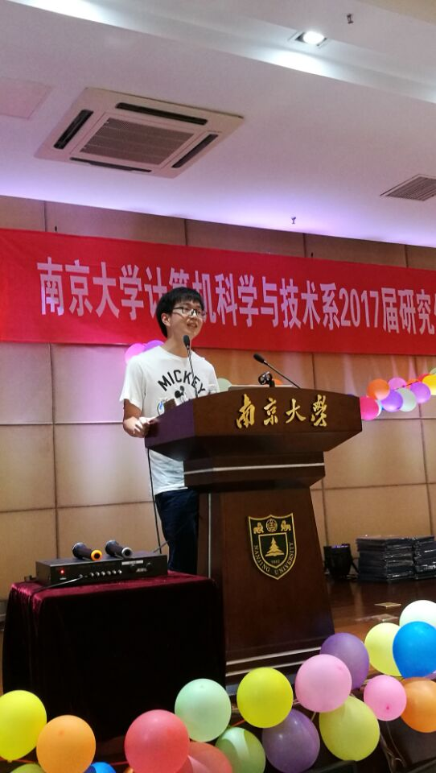

title:  Qiwei Li Gave The Valedictory Speech At This Year's CS Graduation Ceremony
date: 2017-06-21
img_title: Qiwei Li
img_path: photo/QiweiLi-news.jpg

# Qiwei Li Gave The Valedictory Speech At This Year's CS Graduation Ceremony

[Qiwei Li](http://moon.nju.edu.cn/people/qwli), a graduate student in [ICS](http://moon.nju.edu.cn), just obtained his master degree and gave the valedictory speech at this year's CS graduation ceremony on behalf of all graduate students.

Qiwei Li is supervised by Prof. [Chang Xu](http://cs.nju.edu.cn/changxu). His research helps Android app developers to diagnose energy and concurrency bugs.
Before joining ICS, he obtained his bachelor degree from the Elite Class of Department of Computer Science Nanjing University (with the highest GPA ranked No. 1) at 2014.
He received a special offer from Huawei and will join Huawei Nanjing R&D Center this summer.

Every year many excellent students graduate from ICS.
Thanks those outstanding ICS members for their contributions.

Wish all of them have a great future.

