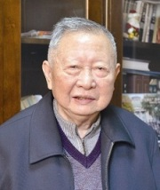

title: In Memory of Professor Jiafu Xu
date: 2018-01-16
img_path: photo/jiafu.jpg
summary: Professor Jiafu Xu, a pioneering Researcher and educator of software technology in China, CCF Lifetime Achievement Award winner, and the Founding Director of ICS, dies at home in Nanjing Jan. 16.

# In Memory of Professor Jiafu Xu

  

Professor Jiafu Xu, a pioneering researcher and educator of software technology in China, CCF Lifetime Achievement Award winner, and the Founding Director of ICS, dies at home in Nanjing Jan. 16. He was 94.

Professor Jiafu Xu was a leading scientist of computer software and a pioneer of Chinese software, and was widely recognized by his contributions to the first ALGOL system in China, the system programming language XCY, and contributions to the software automation.

