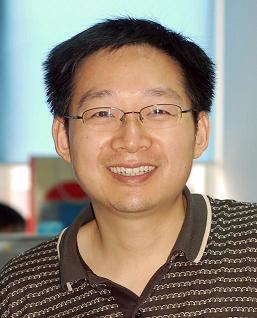

title: Feng Xu

    
<!-- row -->
        

            
        

        

            
<!-- nesting row -->
                

                    <h1>徐 锋</h1>
                

                

                    <h1>Feng Xu</h1>
                

            
<!-- nesting row end -->
            
<!-- nesting row -->
                

                    博士，教授（博导）
                

                

                    Ph.D., Professor
                

            
<!-- nesting row end -->
            
<!-- nesting row -->
                

                    南京大学计算机科学与技术系
                

                

                    Department of Computer Science and Technology, Nanjing University
                

            
<!-- nesting row end -->
            
<!-- nesting row -->
                

                    南京市栖霞区仙林大道163号
                

                

                    163# Xianlin Road, Nanjing 210023, Jiangsu, China
                

            
<!-- nesting row end -->
            
<!-- nesting row -->
                

                计算机系楼817
                

                

                Computer Building 817
                

            
<!-- nesting row end -->
            
<!-- nesting row -->
                

                    E-mail: </img>
                

            
<!-- nesting row end -->
            
<!-- nesting row -->
                

                    Tel: +86 25 83686590
                

            
<!-- nesting row end -->
        

    
<!-- row end -->

## Research interests

* Software Defect Localization
* Data Mining
* Recommender Systems
* Trust Management

## Some recent publications

   * Yuan Yao, Hanghang Tong, *Feng Xu*, and Jian Lu, “Scalable Algorithms for CQA Post Voting Prediction”, IEEE Transactions on Knowledge and Data Engineering, 2017
   * Yuan Yao, Xin Zhao, Yaojing Wang, Hanghang Tong, *Feng Xu*, and Jian Lu, “Version-Aware Rating Prediction for Mobile App Recommendation”, ACM Transactions on Information Systems, 2017
   * Yong Wu, Yuan Yao, *Feng Xu*, Hanghang Tong, and Jian Lu, “Tag2Word: Using Tags to Generate Words for Content Based Tag Recommendation” , in CIKM, Indianapolis, USA, October 24-28 , 2016
   * Licheng Li, Yuan Yao, *Feng Xu*, Jian Lu. MATAR: Keywords Enhanced Multi- Label Learning for Tag Recommendation. The 17th Asia-Pacific Web Conference (APWeb), 2015.
   * Guo Yan, Yuan Yao, *Feng Xu*, Jian Lu. RIT: Enhancing Recommendation with Inferred Trust. The 19th Pacific-Asia Conference on Knowledge Discovery and Data Mining (PAKDD), pp. 756–767, 2015.
   * Yuan Yao, Hanghang Tong, Tao Xie, Leman Akoglu, *Feng Xu*, Jian Lu. Detect- ing High-quality Posts in Community Question Answering Sites. Information Sciences, vol. 302, pp. 70-82, 2015. 
   * Xiaoyu Chen, Yuan Yao, *Feng Xu*, Jian Lu, Exploring Review Content for Recommendation via Latent Factor Model, PRICAI'14 (The 13th Pacific Rim International Conference on Artificial Intelligence), 1 - 5 December, 2014, Gold Coast, Australia.
   * Yuan Yao, Hanghang Tong, Guo Yan, *Feng Xu*, Xiang Zhang, Boleslaw Szymanski, Jian Lu, Dual-Regularized One-Class Collaborative Filtering, CIKM'14 (The 23rd ACM International Conference on Information and Knowledge Management), 3 - 7 November, 2014, Shanghai, China.
   * Yuan Yao, Hanghang Tong, *Feng Xu*, Jian Lu, Predicting Long-Term Impact of CQA Posts: A Comprehensive Viewpoint, KDD'14 (The 20th ACM SIGKDD Conference on Knowledge Discovery and Data Mining), 24 - 27 August, 2014, New York, USA. (acceptance rate 14.6% )

(<a href="publications">A full list...</a>)

## Teaching

* 2008-2017, Spring: Operating System
* 2018, Spring: [Operating System](OS2018)

## Awards

* 2006: 国家科技进步二等奖
* 2010: 教育部高校优秀科研成果技术发明一等奖

## Join Us
* 欢迎本科生提前进组
* 招收硕士、博士研究生