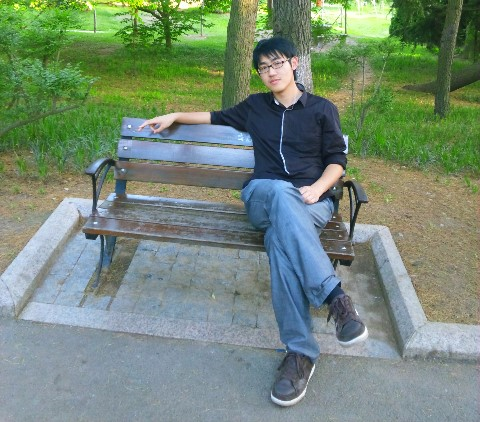

title: Jue Wang

# Jue Wang 王珏

Ph.D. Candidate, Department of Computer Science and Technology, Nanjing University

<table width="1080px"><tr><td>
	
	

		I amd supervised by Prof. Jian Lu (吕建).
	

	

		I received my B.Sc. degree on computer science and technology from Nanjing University in 2016.
	

	

		I am currently working on Android app testing. 
	

</td></tr></table>

## Publications
* {{ render_bib_entry(g.site.spar_paper.wang_EGreenDroid_2016, hl='Jue Wang')}}

##Contact

<table>
	<tr valign="top">
		<td align="right"><b>Email: </b></td><td></td>
	</tr>
	<tr valign="top">
		<td align="right"><b>Addr: </b></td><td>Jue Wang,  Department of Computer Science and Technology,  Nanjing University, 163 Xianlin Avenue,  Qixia District, Nanjing 210023, JiangSu, China.</td>
	</tr>
</table>

Last Update: Oct 18, 2016
