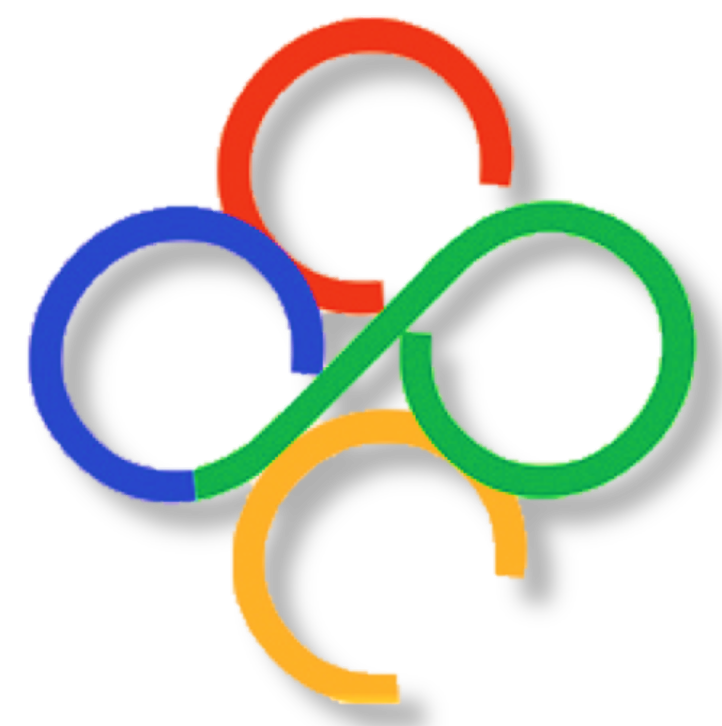
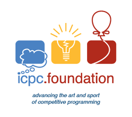
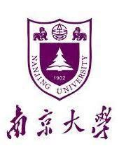

title: Jun Ma

    
<!-- row -->
        

            
        

        

            
<!-- nesting row -->
                

                    <h1>马 骏</h1>
                

                

                    <h1>Jun MA</h1>
                

            
<!-- nesting row end -->
            
<!-- nesting row -->
                

                    博士，讲师
                

                

                    Ph.D., Assistant Professor
                

            
<!-- nesting row end -->
            
<!-- nesting row -->
                

                   南京大学ACM-ICPC集训队教练
                

                

                  Coach of NJU ACM-ICPC Training Team
                

            
<!-- nesting row end -->
			
<!-- nesting row -->
                

                    南京大学计算机科学与技术系
                

                

                    Department of Computer Science and Technology, Nanjing University
                

            
<!-- nesting row end -->
            
<!-- nesting row -->
                

                    南京市栖霞区仙林大道163号
                

                

                    163# Xianlin Road, Nanjing 210023, Jiangsu, China
                

            
<!-- nesting row end -->
            
<!-- nesting row -->
                

                    计算机系楼819
                

                

                    Computer Building 819
                

            
<!-- nesting row end -->
			
            
<!-- nesting row -->
                

                    E-mail: </img>
                

            
<!-- nesting row end -->
            
<!-- nesting row -->
                

                    Tel: +86 25 89680922
                

            
<!-- nesting row end -->
        

## News
*   Congratulations to Hao LING, Hongyang LIU and Yangbo ZHANG for winning the runnerup in the finals of the 5-th Chinese Collegiate Programing Contest.
*   Congratulations to Shaoyuan CHEN, Dongyang WANG and Chunyang WANG for winning the 4-th place in the finals of the 5-th Chinese Collegiate Programing Contest.
*   Congratulations to Hao LING, Hongyang LIU and Yangbo ZHANG for winning the championship in the 44th ACM-ICPC Asia Regional (Nanchang).
*   Congratulations on Cao Yang's FCS paper "Perspectives on Search Strategies in Automated Test Input Generation".

## Bio

*  I obtained my Ph.D. degree in computer science and technology from Nanjing University (NJU) in 2015 (Ph.D. advisor: Prof. Xianping TAO), and Bachelor degree in computer science and technology from Nanjing University in 2003.

*  I am now an assistant professor with Nanjing University.

* The coach of NJU ICPC-Training Team since 2007.

## Awards

I received the following awards or honors (reversely chronological order):

* I received "NJU Liu Houjun Teaching Award" (南京大学刘厚俊奖教金) in 2019.
* I received "NJU Sun Zhongxiu Teaching Award" (南京大学孙钟秀奖教金) in 2018.
* I received "NJU Charismatic Advisor Award" (南京大学魅力导师奖) in 2018.
* I received "Jiangsu Computer Society Service Award" (江苏省计算机学会科技服务贡献奖) in 2017 and 2018.
* I received "Outstanding Coach Award" (江苏省大学生程序设计竞赛“优秀教练”)  in 2008.
## Research interests

My current interests focus on following topics:

1. Software Analysis and Testing of Android Apps
    * Resource Leak Detection
    * Repackaging/Cloned App Detection
    * ...
2. Pervasive Computing
    * Context-aware Computing
    * Smart Space

# Publications

* [Please click here to see my publications](publications)

## Teaching

* 2018, Autumn: [Problem Solving(1)](http://cslabcms.nju.edu.cn/problem_solving/index.php/2019%E7%BA%A7--%E5%AD%A6%E6%9C%9F%E5%AE%89%E6%8E%92_(%E7%AC%AC%E4%B8%80%E5%AD%A6%E6%9C%9F)) (Dept. CSE)
* 2019, Spring: [Problem Solving(4)](http://cslabcms.nju.edu.cn/problem_solving/index.php/2017%E7%BA%A7--%E5%AD%A6%E6%9C%9F%E5%AE%89%E6%8E%92_(%E7%AC%AC%E5%9B%9B%E5%AD%A6%E6%9C%9F)) (Dept. CSE)
* 2018, Autumn: [Problem Solving(3)](http://cslabcms.nju.edu.cn/problem_solving/index.php/2017%E7%BA%A7--%E5%AD%A6%E6%9C%9F%E5%AE%89%E6%8E%92_(%E7%AC%AC%E4%B8%89%E5%AD%A6%E6%9C%9F)) (Dept. CSE)
* 2018, Spring: [Problem Solving(2)](http://cslabcms.nju.edu.cn/problem_solving/index.php/2017%E7%BA%A7--%E5%AD%A6%E6%9C%9F%E5%AE%89%E6%8E%92_(%E7%AC%AC%E4%BA%8C%E5%AD%A6%E6%9C%9F)) (Dept. CSE)
* 2017, Autumn: [Problem Solving(1)](http://cslabcms.nju.edu.cn/problem_solving/index.php/2017%E7%BA%A7) (Dept. CSE)
* 2017, Spring: [Problem Solving(4)](http://cslabcms.nju.edu.cn/problem_solving/index.php/2015%E7%BA%A7--%E5%AD%A6%E6%9C%9F%E5%AE%89%E6%8E%92_(%E7%AC%AC%E5%9B%9B%E5%AD%A6%E6%9C%9F)) (Dept. CSE)
* 2016, Autumn: [Problem Solving(3)](http://cslabcms.nju.edu.cn/problem_solving/index.php/2015%E7%BA%A7--%E5%AD%A6%E6%9C%9F%E5%AE%89%E6%8E%92_(%E7%AC%AC%E4%B8%89%E5%AD%A6%E6%9C%9F)) (Dept. CSE)
* 2016, String: [Problem Solving(2)](http://cslabcms.nju.edu.cn/problem_solving/index.php/2015%E7%BA%A7--%E5%AD%A6%E6%9C%9F%E5%AE%89%E6%8E%92_(%E7%AC%AC%E4%BA%8C%E5%AD%A6%E6%9C%9F)) (Dept. CSE)
* 2015, Autumn: [Problem Solving(1)](http://cslabcms.nju.edu.cn/problem_solving/index.php/2015%E7%BA%A7) (Dept. CSE)
* 2015, Spring: [Problem Solving(4)](http://cslabcms.nju.edu.cn/problem_solving/index.php/2013%E7%BA%A7--%E5%AD%A6%E6%9C%9F%E5%AE%89%E6%8E%92_(%E7%AC%AC%E5%9B%9B%E5%AD%A6%E6%9C%9F)) (Dept. CSE)
* 2014, Autumn: [Problem Solving(3)](http://cslabcms.nju.edu.cn/problem_solving/index.php/2013%E7%BA%A7--%E5%AD%A6%E6%9C%9F%E5%AE%89%E6%8E%92_(%E7%AC%AC%E4%B8%89%E5%AD%A6%E6%9C%9F)) (Dept. CSE)
* 2012-2014, Summer:ACM/ICPC Programming (Dept. CSE)
* 2009, Autumn:Preliminary Problem Solving (Dept. CSE)
