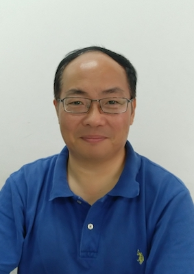

title: Xianping Tao

    
<!-- nesting row -->
        

            陶先平 博士
        

    
<!-- nesting row end -->
    

    
<!-- nesting row -->
        

            南京大学计算机科学与技术系 教授，博士生导师
        

    
<!-- nesting row end -->
    
<!-- nesting row -->
        

            南京大学计算机软件新技术国家重点实验室
        

    
<!-- nesting row end -->
    

    
<!-- row -->
        

            
        

        

            
<!-- nesting row -->
                

                    地址:
                

                

                    

                        

                            中国江苏省南京市栖霞区仙林大道 163 号
                        

                    

                    

                        

                            南大仙林校区 603 信箱计算机系
                        

                    

                    

                        

                            邮编: 210023
                        

                    

                

            
<!-- nesting row end -->
            
<!-- nesting row -->
                

                    办公室:
                

                

                    

                        

                            计算机科学与技术楼 815
                        

                    

                

            
<!-- nesting row end -->
            
<!-- nesting row -->
                

                    电话:
                

                

                    

                        

                            +86 25 83593694
                        

                    

                

            
<!-- nesting row end -->
            
<!-- nesting row -->
                

                    Email:
                

                

                    

                        

                            txp (AT) nju (DOT) edu (DOT) cn
                        

                    

                

            
<!-- nesting row end -->
            
<!-- nesting row -->
                

                     <a href="https://scholar.google.com/citations?user=F3mGYVoAAAAJ&hl=en">[Google Citations]</a>
                     <a href="http://dblp.uni-trier.de/pers/hd/t/Tao:XianPing">[DBLP]</a>
                

            
<!-- nesting row end -->
        

    
<!-- row end -->

----------------

## 研究兴趣：
* 自适应软件工程
* 群智认知
* 普适计算技术
* 软件中间件技术

## 个人简历

* 本科：国防科大计算机系，计算机软件
* 硕士：南京大学计算机系，计算机软件与理论，师从徐家福先生
* 博士：南京大学计算机系，计算机软件与理论，师从吕建院士

## 发表论文

近期部分论文：

{{ render_bib_file('recent-CCF-A-and-B.bib', hl='Xianping Tao') }}

## 学术兼任：
* 教育部大学计算机教指委委员
* IEEE、ACM会员、中国计算机学会（CCF）高级会员、江苏省计算机学会教育工委主任
* CCF系统软件、软件工程专委委员
* 金陵学院软件工程专业负责人
* 中国计算机实践教育学术会议程序委员会主席（2017-2019）
* 曾任：CCF教育工作委员会副主任、中国计算机学会系统软件专委秘书长。

## 社会兼任：
* 南京市栖霞区政协委员
* 曾任: 南京大学计算机系副系主任

## 教学工作：
* 《问题求解系列》（计算机科学拔尖计划），2013-今
* 《数据与计算》：计算机科学与技术专业平台课程，2013-今
* 《离散数学》：计算机科学与技术专业平台课程，2005-2015

## 学术荣誉获奖：
* 2004：MOE Award for S&T Research in Universities ,1st class,（教育部高校优秀科研成果技术进步一等奖，第二完成人）
* 2006: China National Award for Science and Technology Progress, 2nd prize.（国家科技进步二等奖，第三完成人）
* 2010: MOE Award for S&T Research in Universities, Ministry of Education.（教育部高校优秀科研成果技术发明一等奖，第五完成人）
* 2011: China National Award for Science and Technology Progress, 2nd prize.（国家科技进步二等奖，第五完成人）

## 教学荣誉获奖：
* 2013年度荣获江苏省教学成果特等奖（第二完成人）
* 2014年度荣获国家教学成果二等奖（第二完成人）
* 2016年荣获宝钢优秀教师奖
* 2019年计算机系“我心目中的好课程”

## 博士生培养（协助指导或指导）：
* 马骏：Study on Enabling Techniques for Incremental Development of Smart Space Applications，现工作于南京大学
* 汪亮：Research on Wearable Sensor Network Based Human Activity Recognition Technologies，现工作于南京大学
* 董恺：Research on Key Technologies of Preserving Location Privacy in Location Based Services，现工作于东南大学
* 叶海波：Smartphone based Indoor Localization for Symbolic Position，现工作于南京航空航天大学
* 徐经纬：Second-order Rating Distance for Recommender Systems，现工作于南京大学
* 朱晓瑞：Research on Key Technologies for Reprogramming Wireless Sensor Network Applications，现工作于河海大学
* 李晅松：Research on Technologies of Design and Implementation for Activity-Oriented Context-Aware （AOCA）Application Systems，现工作于南京理工大学
