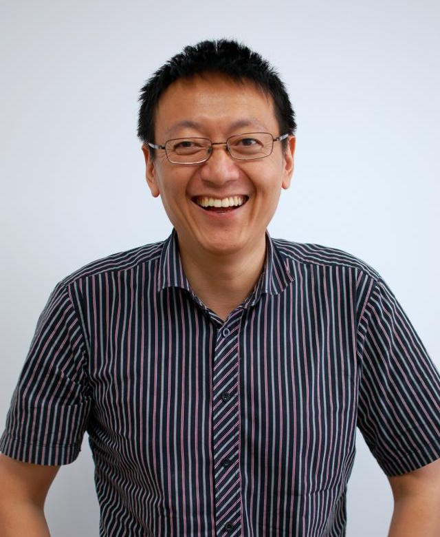

title: Xiaoxing Ma (Chinese)

<a href="../">English</a>
中文

    
<!-- row -->
        

            
        

        

            
<!-- nesting row -->
                

                    马晓星 博士
                

            
<!-- nesting row end -->
            
<!-- nesting row -->
                

                    南京大学计算机科学与技术系 教授，博士生导师
                

            
<!-- nesting row end -->
            
<!-- nesting row -->
                

                    南京大学计算机软件研究所 副所长
                

            
<!-- nesting row end -->
            
<!-- nesting row -->
                

                    南京大学计算机软件新技术国家重点实验室
                

            
<!-- nesting row end -->
            
<!-- nesting row -->
                

                    地址:
                

                

                    

                        

                            中国江苏省南京市栖霞区仙林大道 163 号
                        

                    

                    

                        

                            南大仙林校区 603 信箱计算机系
                        

                    

                    

                        

                            邮编: 210023
                        

                    

                

            
<!-- nesting row end -->
            
<!-- nesting row -->
                

                    办公室:
                

                

                    

                        

                            计算机科学与技术楼 816
                        

                    

                

            
<!-- nesting row end -->
            
<!-- nesting row -->
                

                    电话:
                

                

                    

                        

                            +86 25 89686068
                        

                    

                

            
<!-- nesting row end -->
            
<!-- nesting row -->
                

                    传真:
                

                

                    

                        

                            +86 25 83593283
                        

                    

                

            
<!-- nesting row end -->
            
<!-- nesting row -->
                

                    Email:
                

                

                    

                        

                            
                        

                    

                

            
<!-- nesting row end -->
        

    
<!-- row end -->

## 个人简介
马晓星，1975年8月生，1993年进入南京大学计算机科学与技术系学习，于1997年、2000年和2003年分别获得学士、硕士和博士学位。现任南京大学计算机科学与技术系教授、博士生导师，南京大学计算机软件研究所副所长。其研究领域为计算机软件技术，近年来工作重点包括网构软件、自适应软件系统、软件在线演化等面向开放环境的软件新技术。主持承担包括国家自然科学基金项目、国家重大基础研究计划（973）课题、国家高技术研究发展计划（863）课题在内的多项国家级科研项目。在ICSE、FSE、ASE等国际会议和IEEE  TSE、TC、TPDS、TSC以及CACM、IST、JSS等国际期刊和《中国科学》、《软件学报》等国内一级学报发表学术论文60余篇。曾任ICSE '10  Education Track、SCORE '11、SEAMS '12-'14, '16 等国际学术会议和竞赛的程序委员、Internetware  '15程序委员会主席、《软件学报》责任编委。曾两次获得国家科技进步二等奖（2006年度/第二完成人，2011年度/第四完成人），两次获得教育部一等奖（2004年度/第三完成人，2010年度/第二完成人）；还曾获2009年度中创软件人才奖、2015年度东软－NASAC青年软件创新奖。2007年入选教育部新世纪优秀人才支持计划，2013年入选江苏省“333工程”第二层次培养对象。

## 研究兴趣
我的研究领域属于软件技术与软件工程，目前已有的工作集中于以下几方面：

* __自适应软件系统__: 使软件更加智能以自动感知并适应用户需求和运行环境的变化；
* __软件在线演化__: 无需关停运行中的软件系统而对其进行在线的更新；
* __网构软件__: 探索面向开放的互联网的新软件范型及其关键技术。

近期尤其关注：

* __复杂软件系统的智能化__: 以何种智能化的方法来应对开放环境下“人-机-物”三元融合系统所面临的各种非确定性；
* __智能软件系统的可信化__: 如何刻画并保障具有学习能力的智能化软件系统的可信性。

## [发表论文](../publications)
近期部分论文：

{{ render_bib_file('../xiaoxingma.bib', ['WSongTSE2018','ConUpTSE_2017','TGuASE2016','YYangTC16MIPA','jiang_crash_2016','jiang_online_2016','Xu:2015:TSE','JavelusIST14','JYY:2014:ICSE'], hl='Xiaoxing Ma') }}

(还有...[英文论文](../publications), [中文论文](http://www.c-dblp.cn/search_result.php?author_name=%E9%A9%AC%E6%99%93%E6%98%9F); [DBLP](http://dblp.uni-trier.de/pers/hd/m/Ma:Xiaoxing), [Google Scholar](https://scholar.google.com/citations?user=44WpWR4AAAAJ))

## 研究项目
目前作为负责人承担的研究项目: 

* 国家自然科学基金重大项目课题: __面向演化的群智化软件建模与构造方法__, 批准号:61690204, 2017-2021.
* 国家重点基础研究计划（973计划）课题: __持续演进的自适应网构软件模型、方法及服务质量保障__, 批准号:2015CB352202, 2015-2019.
* 国家自然科学基金面上项目: __自适应软件系统的无缝演化与环境感知技术研究__, 批准号: 61472177, 2015-2018. 

## 课程教学
* 离散数学 2014-2018 （计算机系）
* 离散数学 2013-2017 （软件学院）
* 程序设计语言概论 （计算机系）
* 面向对象的软件构造 （计算机系）

## 荣誉奖励
* 2011年度国家科技进步二等奖：“网构软件技术、平台与应用”，第2完成人。
* 2006年度国家科技进步二等奖：“对象化与主体化的软件协同技术、平台与应用”，第4完成人。
* 2010年度教育部高等学校科学研究优秀成果奖技术发明奖，“网构化软件关键技术、平台与应用”，第2完成人。
* 2009年度 “中创软件人才” 奖。
* 2007年度入选教育部 “新世纪优秀人才支持计划”。

## 学术服务

* 国际会议程序委员
    * ICECCS [2018](http://formal-analysis.com/iceccs/2018/),[2017](https://iceccs.github.io/2017/): 23rd/22nd International Conference on Engineering of Complex Computer Systems
    * [IEEE ATC 2018](http://www.smart-world.org/2018/atc/): 15th International Conference on Advanced and Trusted Computing. PC Co-Chair.
    * SEAMS [2018](https://conf.researchr.org/home/seams-2018), [2017](https://wp.doc.ic.ac.uk/seams2017/), [2016](http://seams2016.jgreen.de/), [2014](http://seams2014.uni-paderborn.de/), [2013](http://www.yorku.ca/mlitoiu/seams2013/), [2012](http://www.seams2012.cs.uvic.ca/):  International Symposium on Software Engineering for Adaptive and Self-Managing Systems
    * Internetware [2015 PC Co-Chair](http://internetware2015.trustie.net/), 2014, 2013: 7th/6th/5th Asia-Pacific Symposium on Internetware 
    * [SOSE 2013](http://sei.pku.edu.cn/conference/sose2013/): 7th International Symposium on Service Oriented System Engineering
    * [WICSA/ECSA 2012 - Joint 10th Working IEEE/IFIP Conference on Software Architecture & 6th European Conference on Software Architecture](http://www.wicsa.net/)
    * VINCI 2011, 2010, 2009: [Visual Information Communication - International Symposium](http://www.cse.ust.hk/vinci2011/)
    * SCORE 2011: [Student Contest on Software Engineering](http://score-contest.org/2011/)
    * [Software engineering education track of ICSE 2010](http://www.sbs.co.za/ICSE2010/3-EVENTS/_TRACKS/ICSE2010_SE-EDUCATION.html)

* 期刊编委
   * [软件学报](http://www.jos.org.cn)  2011至今
* 客座编辑
   * [Special Section on Software Systems](http://jcst.ict.ac.cn:8080/jcst/EN/column/item161.shtml), _Journal of Computer Science and Technology_, September 2017.
    * Special Focus on Internetware, _Science China: Information Sciences_ Volume 56, Number 1, January 2013.
    * Special Focus on Self-adaptive Software Systems: Development Methods and Runtime Supports. _Journal of Software_ Volume 26, Number 4, April 2015.

## 学生招募
_软件定义一切，数据产生智能。世界已不同于昨日，你意识到了吗？_

本团队长期招募优秀潜质的博士和硕士研究生。如果你有志于研究软件工程和软件系统的前沿问题，追寻程序员的光荣与梦想，欢迎与我联系！
 

<!-- Maintained by [Xiaoxing Ma](/people/xiaoxingma) Last updated 2018-05-22 --->
