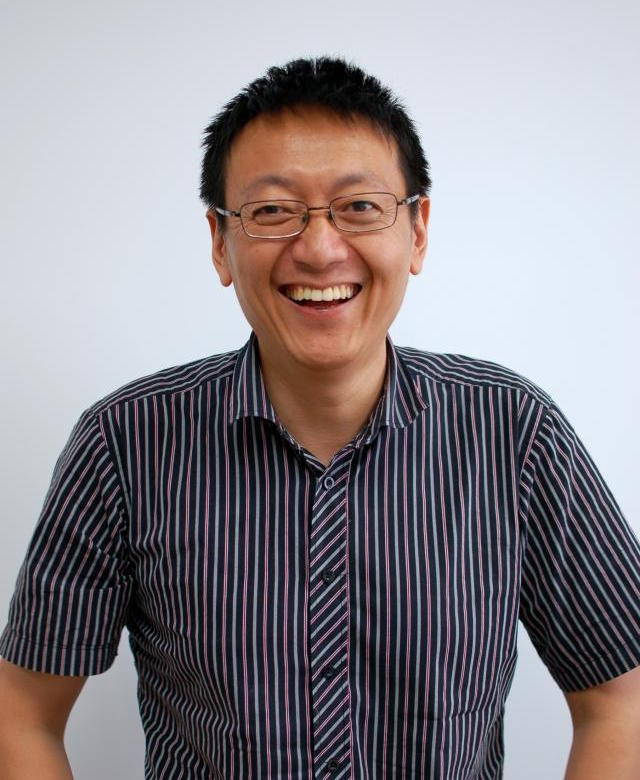

title: Xiaoxing Ma

English
<a href="cn/">中文</a>

    
<!-- row -->
        

            
        

        

            
<!-- nesting row -->
                

                    Dr. Xiaoxing Ma
                

            
<!-- nesting row end -->
            
<!-- nesting row -->
                

                    Professor
                

            
<!-- nesting row end -->
            
<!-- nesting row -->
                

                    State Key Laboratory for Novel Software Technology, Nanjing University
                

            
<!-- nesting row end -->
            
<!-- nesting row -->
                

                    Department of Computer Science and Technology, Nanjing University
                

            
<!-- nesting row end -->
            
<!-- nesting row -->
                

                    Address:
                

                

                    

                        

                            Department of Computer Science,
                        

                    

                    

                        

                            Nanjing University Xianlin Campus (Mailbox 603),
                        

                    

                    

                        

                            163 Xianlin Avenue, Qixia, Nanjing 210023, Jiangsu, China
                        

                    

                

            
<!-- nesting row end -->
            
<!-- nesting row -->
                

                    Office:
                

                

                    

                        

                            Computer Science and Technology Building 816
                        

                    

                

            
<!-- nesting row end -->
            
<!-- nesting row -->
                

                    Phone:
                

                

                    

                        

                            +86 25 89686068
                        

                    

                

            
<!-- nesting row end -->
            
<!-- nesting row -->
                

                    Fax:
                

                

                    

                        

                            +86 25 83593283
                        

                    

                

            
<!-- nesting row end -->
            
<!-- nesting row -->
                

                    Email:
                

                

                    

                        

                            
                        

                    

                

            
<!-- nesting row end -->
        

    
<!-- row end -->

<!--
## Short biography
Dr. Xiaoxing Ma is a professor at the [[http://cs.nju.edu.cn][Department of Computer Science and Technology]], [[http://www.nju.edu.cn][Nanjing University]]. He got his B.Sc., M.Sc. and Ph.D., all in Computer Science, from the same University in 1997, 2000 and 2003, respectively. 

He worked as a Borsa Post-Doc in the [[http://deepse.dei.polimi.it/][DEEP-SE group]], [[http://www.polimi.it/][Politecnico di Milano]] from Dec. 2009 to Nov. 2010. He was once a research assistant in the [[http://www.comp.polyu.edu.hk/][Department of Computing]], [[http://www.polyu.edu.hk/][Hong Kong Polytechnic University]] from Oct. 2001 to Mar. 2002. 
-->

## Research interests

I am interested in various topics in software engineering, especially

* Adaptive software systems
    * System-environment sensing and understanding 
    * Dynamic system reconfiguration
    * Adaptation planning 
* Software architectures and middleware systems
* Assurance of non-functional software qualities

## [Publications](publications)
**Some recent papers:**

{{ render_bib_file('xiaoxingma.bib', ['WSongTSE2018','TGuECOOP18','ConUpTSE_2017','TGuASE2016','YYangTC16MIPA','jiang_crash_2016','jiang_online_2016','Xu:2015:TSE','JavelusIST14','JYY:2014:ICSE'], hl='Xiaoxing Ma') }}

**More publications:** [_In English_](publications), [_In Chinese_](http://www.c-dblp.cn/search_result.php?author_name=%E9%A9%AC%E6%99%93%E6%98%9F); or in [DBLP](http://dblp.uni-trier.de/pers/hd/m/Ma:Xiaoxing), [Google Scholar](https://scholar.google.com/citations?user=44WpWR4AAAAJ).

## Teaching
   * Discrete Mathematical Structures: [2014-2017, Autumn](DMS2013.html) (Inst. Softw.)
   * Discrete Mathematics and Its Applications: [2014-2018, Spring](http://cslabcms.nju.edu.cn/course/view.php?id=274) (Dept. CS)
   * Concepts of Programming Languages: [2008-2014, Spring](copl)
   * Object-Oriented Software Construction: [Before 2007](OOT2007.html)

## Awards
   * 2006: China National Award for Science and Technology Progress, 2nd prize. Dr. Ma is the 2nd awardee of the team. （国家科技进步二等奖，第二完成人）
   * 2011: China National Award for Science and Technology Progress, 2nd prize. Dr. Ma is the 4th awardee of the team. （国家科技进步二等奖，第四完成人）
   * 2010: MOE Award for S&T Research in Universities, 1st class, Ministry of Education. I am the 2nd awardee of the team. （教育部高校优秀科研成果技术发明一等奖，第二完成人）
   * 2009: _CVIC SE_ Award for Software Researchers. （中创软件人才奖）

## Professional activities

* Member of program committees 
    * ICECCS [2018](http://formal-analysis.com/iceccs/2018/),[2017](https://iceccs.github.io/2017/): 23rd/22nd International Conference on Engineering of Complex Computer Systems
    * [IEEE ATC 2018](http://www.smart-world.org/2018/atc/): 15th International Conference on Advanced and Trusted Computing. PC Co-Chair.
    * SEAMS [2018](https://conf.researchr.org/home/seams-2018), [2017](https://wp.doc.ic.ac.uk/seams2017/), [2016](http://seams2016.jgreen.de/), [2014](http://seams2014.uni-paderborn.de/), [2013](http://www.yorku.ca/mlitoiu/seams2013/), [2012](http://www.seams2012.cs.uvic.ca/):  International Symposium on Software Engineering for Adaptive and Self-Managing Systems
    * Internetware [2015 PC Co-Chair](http://internetware2015.trustie.net/), 2014, 2013: 7th/6th/5th Asia-Pacific Symposium on Internetware 
    * [SOSE 2013](http://sei.pku.edu.cn/conference/sose2013/): 7th International Symposium on Service Oriented System Engineering
    * [WICSA/ECSA 2012 - Joint 10th Working IEEE/IFIP Conference on Software Architecture & 6th European Conference on Software Architecture](http://www.wicsa.net/)
    * VINCI 2011, 2010, 2009: [Visual Information Communication - International Symposium](http://www.cse.ust.hk/vinci2011/)
    * SCORE 2011: [Student Contest on Software Engineering](http://score-contest.org/2011/)
    * [Software engineering education track of ICSE 2010](http://www.sbs.co.za/ICSE2010/3-EVENTS/_TRACKS/ICSE2010_SE-EDUCATION.html)
* Editorial Board Member 
    * [Journal of Software](http://www.jos.org.cn) (in Chinese), since Jan. 2011.
* Guest Editor 
    * [Special Section on Software Systems](http://jcst.ict.ac.cn:8080/jcst/EN/column/item161.shtml), _Journal of Computer Science and Technology_, September 2017.
    * Special Focus on Internetware, _Science China: Information Sciences_ Volume 56, Number 1, January 2013.
    * Special Focus on Self-adaptive Software Systems: Development Methods and Runtime Supports. _Journal of Software_ Volume 26, Number 4, April 2015.
