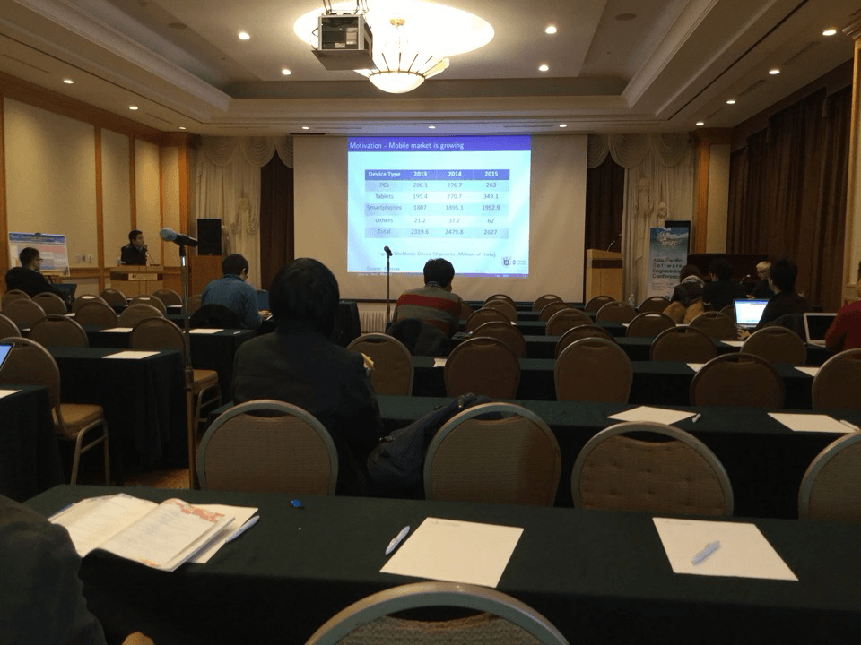
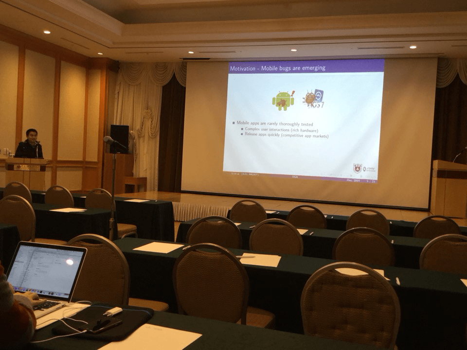
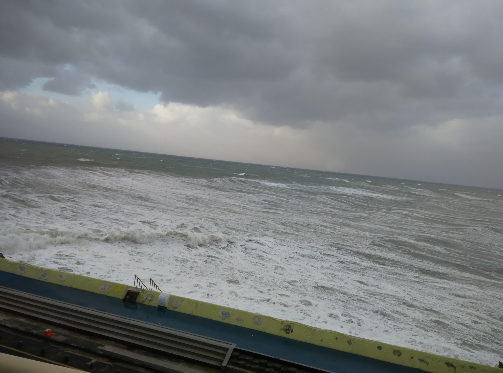
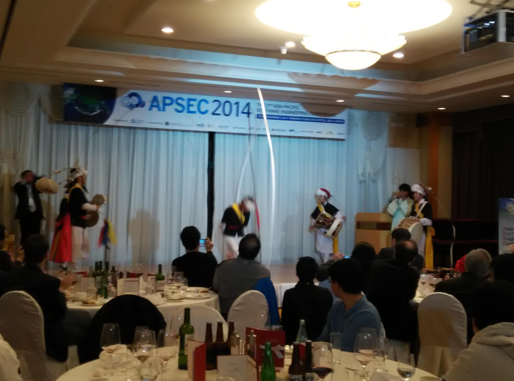
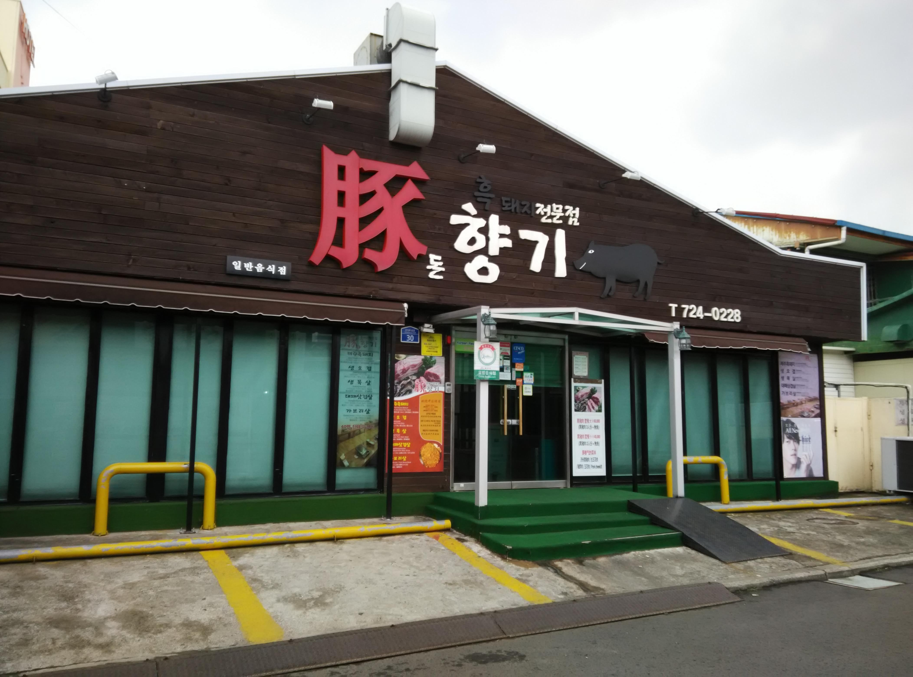

<h2 class="intro-text text-center">Personal
    <strong>Blog</strong>
</h2>

<h2>UGA Website
     
    <small>December 9, 2014</small>
</h2>

<strong>1. On-site presentation</strong>

<!-- Indicators -->
<ol class="carousel-indicators">
<li data-target="#carousel-example-generic_onsite" data-slide-to="0" class="active"></li>
<li data-target="#carousel-example-generic_onsite" data-slide-to="1"></li>
</ol>

<!-- Wrapper for slides -->

<!-- Controls -->
<a class="left carousel-control" href="#carousel-example-generic_onsite" role="button" data-slide="prev">

Previous
</a>
<a class="right carousel-control" href="#carousel-example-generic_onsite" role="button" data-slide="next">

Next
</a>

<strong>2. Slides & Data</strong>

&nbsp;&nbsp;&nbsp;&nbsp;Slides: <a href="../img/UGA/APSEC-UGA.pdf">Download</a>

&nbsp;&nbsp;&nbsp;&nbsp;Training Plan: <a href="../img/UGA/TrainPlan.pdf">Download</a> &nbsp;&nbsp;&nbsp;&nbsp;(Our experiment also targets people without any smartphone experience, so we need train them first)

&nbsp;&nbsp;&nbsp;&nbsp;Experimental Data: <a href="http://yunpan.cn/cKrfKzF9YFyRQ" target="_blank">Download</a> 

<strong>3. Photos in Jeju Island</strong>

<!-- Indicators -->
<ol class="carousel-indicators">
<li data-target="#carousel-example-generic_jeju_island" data-slide-to="0" class="active"></li>
<li data-target="#carousel-example-generic_jeju_island" data-slide-to="1"></li>
<li data-target="#carousel-example-generic_jeju_island" data-slide-to="2"></li>
<li data-target="#carousel-example-generic_jeju_island" data-slide-to="3"></li>
<li data-target="#carousel-example-generic_jeju_island" data-slide-to="4"></li>
<li data-target="#carousel-example-generic_jeju_island" data-slide-to="5"></li>
<li data-target="#carousel-example-generic_jeju_island" data-slide-to="6"></li>
<li data-target="#carousel-example-generic_jeju_island" data-slide-to="7"></li>
</ol>

<!-- Wrapper for slides -->

 <h4>Outside the hotel</h4>

 <h4>In the hotel</h4>

 <h4></h4>

 <h4></h4>

 <h4>Yongdusan</h4>

 <h4>Korean folk</h4>

 <h4>Korean folk</h4>

 <h4>Black pig</h4>

<!-- Controls -->
<a class="left carousel-control" href="#carousel-example-generic_jeju_island" role="button" data-slide="prev">

Previous
</a>
<a class="right carousel-control" href="#carousel-example-generic_jeju_island" role="button" data-slide="next">

Next
</a>

 	

---OVER---

