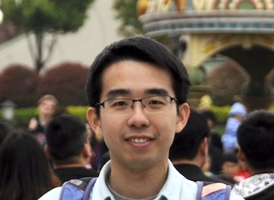
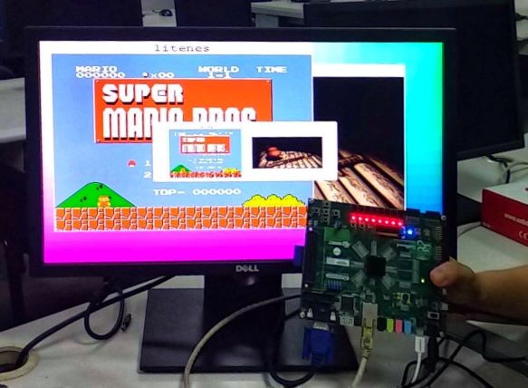
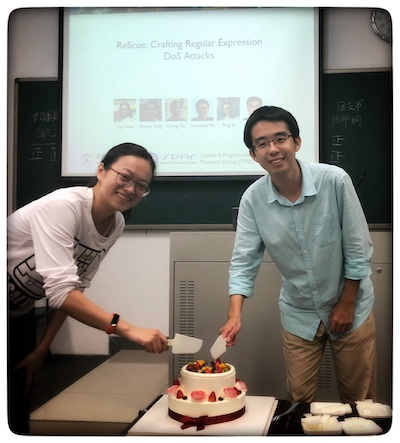

title: Yanyan Jiang

# Yanyan Jiang 蒋炎岩 

  

Assistant Researcher, [SPAR ](/spar/) - [CASTLE ](http://sccpu2.cse.ust.hk/castle/index.html) Joint Group Dept. of Computer Science and Technology, Nanjing University

Ph.D. (*Nanjing University* , 2017) Visiting Scholar (*Ohio State University* , 2015)

## Research

I'm a coder striving to make programs (and programmer's world) better. I'm interested in automated technologies for software and systems: *testing*, *analysis*, and *synthesis*. Chronological list of [my publications](pub). (欢迎关注[知乎专栏:软件工程研究漫谈 ](https://zhuanlan.zhihu.com/se-research))

<ul>
  <li>**Software Testing and Analysis**</li>
  <ul>
    <li>System Software:
    *Compiler Toolchain* (Cod [[ASE19](pubs/c2v)]
    );
    *Concurrent Programs* (SCS [[ESEC/FSE18](pubs/scs)],
      My [PhD Thesis](pubs/thesis),
      Survey [[JoS17](pubs/survey)],
      BC [[FSE16](pubs/bc)],
      RWTrace [[ASE15](pubs/rwtrace)],
      CARE [[ICSE14](pubs/care)]
    );
    *Cloud Systems* (eBugs [[ASE19](pubs/diet)]
    );
    </li>
    <li>Mobile Apps:
    *Platform*
    (ATT [[Internetware15](pubs/att)],
    CoseDroid [[COMPSAC15](pubs/cosedroid)]);
    *Event Generation*
    (Survey [[SCIS19]](pubs/android-survey), AATT [[SCP18](pubs/aattplus), [APSEC16](pubs/aatt)],
    GAT [[APSEC16](pubs/gat)]);
    *Human Insights*
    (UGA [[APSEC14](pubs/uga)]);
    *Analysis*
    (LESDroid [[ICPC18](pubs/lesdroid)],
    RepDroid [[ICPC17](pubs/repdroid)]);
    *Performance*
    (TAPIR [[SANER19]](pubs/tapir));</li>
    <li>General Testing and Analysis:
    Survey [[FCS19](pubs/test-survey)]; 
    *Crash Consistency* (C3 [[FSE16](pubs/c3)]); *Fault Localization* (Comedy [[COMPSAC15](pubs/comedy)]); *Regular Expressions* (ReScue [[ASE18](pubs/rescue)] 🏅);</li>
  </ul>
  <li>**Program Synthesis**</li>
  <ul>
    <li>*Transformers* (AOTES [[ECOOP18](pubs/aotes1), [ICSE17 Poster](pubs/aotes)], ENTER [[ICSE18 Poster](pubs/enter)]);</li>
  </ul>
  <li>**Programming Tricks for Fun and Profits**</li>
  <ul>
    <li>*Software Building* (ABC [[APSEC15](pubs/abc)]); *Runtime Verification* (GAIN [[IST16](pubs/gain1), [APSEC14](pubs/gain)]);</li>
  </ul>
</ul>

<b>Summary</b> (click to magnify)

## Teaching: [Yanyan's Wiki](/~jyywiki)

* 
[Introduction to Computer Systems (Fall 2019)](/~jyywiki/wiki/ICS2019),
[Introduction to Software Engineering Research (Fall 2019)](/~jyywiki/wiki/GSER2019), and
[Operating Systems (Spring 2019)](/~jyywiki/wiki/OS2019).
(Only available for NJU campus-local network.)
* I'm a co-founder (with [Zihao Yu 余子濠](https://sashimi-yzh.github.io)) of *Project-N*  in which undergraduate students build a complete computer system (NPC SoC, NEMU system emulator, Nanos operating system, NCC compiler, and applications) from scratch. 
    * Papers: *Plagiarism Detection* (Needle  [[SIGCSE-China18](pubs/needle)]).
    * We won the *first prize* in 2018 Loongson Cup contest.
* Selected talks:
    * “Building Computer Systems From Scratch Around AbstractMachine”  (CSEW'18).
    * “计算：万物的起源和终点”  (Keynote speech at JSOI'14 Winter Camp).
    * “从逻辑门到电子计算机”  (Guest lecture, 2014).

## Students

I'm co-supervising graduate students with Prof. [Chang Xu](http://cs.nju.edu.cn/changxu) and Prof. [Xiaoxing Ma](/~xxm).
We also welcome [undergraduate research interns](http://ics.nju.edu.cn/~jyywiki/wiki/ICS_NJU).

Current: [Wenjie Li 李文杰](/people/wenjieli) (PhD, Android), [Dongjie Chen 陈冬杰](/~dongjie) (PhD, Kernel and concurrency), [Jue Wang 王珏](/people/juewang) (PhD, Android), [Da Li 李达](/people/dali) (PhD, program repair), Xianfei Ou 欧先飞 (PhD, compilers), Cong Li 李聪 (PhD, Android), Daohan Qu 屈道涵 (PhD, runtime systems), Shixuan Zhao 赵士轩 (Undergrad, Kernel concurrency), Shaoyuan Chen 陈劭源 (Undergrad, program repair), 刘恩萌 (Undergrad, empirical software engineering), 裴一凡 (Undergrad, regex anlaysis), 何伟 (Undergrad, Android), 张天昀 (Undergrad, software updates)

Past ([Details](students); feel free to ask them for anything you want to know about our research group!):

* 2019: [Yang Cao 曹阳](/people/yangcao) (MSc → ByteDance), [Yuju Shen 沈宇桔](/~yuju) (MSc → NetEase Games), [Zhao Gang 刚昭](https://hirico.moe) (BSc → UCSD MSc), Xiaolin Li 李晓霖 (BSc → ICT-CAS MSc), Mingjie Shen 沈明杰 (BSc → Purdue PhD)
* 2018: [Zhanshuai Meng 孟占帅](/people/zhanshuaimeng) (MSc → Ant Financial), [Jiarong Wu 吴嘉荣](http://home.cse.ust.hk/~jwubf/) (BSc → HKUST PhD)

## Services

* PC Member: [ISSTA2019 AEC](https://conf.researchr.org/track/issta-2019/issta-2019-papers), [SATE2019](https://sate2019.github.io), [SATE2018](http://sei.pku.edu.cn/~xiongyf04/confs/sate18/index_en.html); External Reviewer: TSE, TPDS, SCP, Internetware.
*  Steering/Scientific Program Committee member of Jiangsu Olympiad in Informatics.
*  Coach of the programming contest training team at Nanjing University.

## Honors and Awards
* 2018-2020 *CCF Elite Youth Scientists Sponsorship Program* (Top 6 in China).
* 2018 *ACM SIGSOFT Distinguished Paper Award*.
* 2018 *CCF Docotral Disseration Award* (Top 5 in China), *ACM China Doctoral Dissertation Award Nomination* (Top 5 in China).
* 2016 *Distinguished Student* of Nanjing University (the only PhD student out of ten winners).
* 2014 *MSRA Fellowship Award*; 2015 and 2010 *National Scholarship*;
* First Place in 2014 Huawei Cup *Regional Programming Contest*; Second Place in 2012 *Tencent Hackathon*.
* I competed in *ACM-ICPC* regional contests for two Gold Medals and earned 49th Place in the 2009 *World Finals*.

Last Update: August 6, 2019

~~~{.customjs}
$('ul').css('margin-left', '-15px');
$('h2').css('margin-top', '15px');
$('h2').css('margin-bottom', '5px');
~~~
