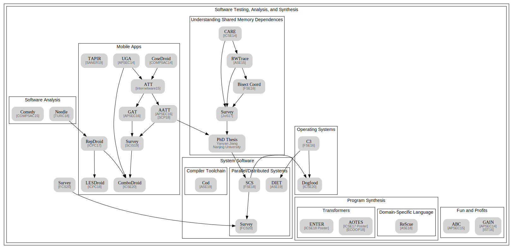
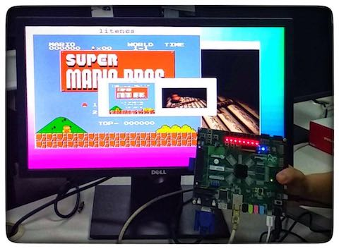

title: Yanyan Jiang

# Yanyan Jiang 蒋炎岩 

  

Assistant Researcher, [SPAR ](/spar/) - [CASTLE ](http://sccpu2.cse.ust.hk/castle/index.html) Joint Group Dept. of Computer Science and Technology, Nanjing University

Ph.D. (*Nanjing University* , 2017) Visiting Scholar (*Ohio State University* , 2015)

## Research

I'm a coder striving to make programs better. I'm interested in automated technologies for software and systems: *testing*, *analysis*, and *synthesis*. Chronological list of [my publications](pub). (欢迎关注[知乎专栏:软件工程研究漫谈 ](https://zhuanlan.zhihu.com/se-research))

<ul>
  <li>**Software Testing and Analysis**</li>
  <ul>
    <li>Concurrent Programs: *Understanding Shared Memory Dependences* (CARE [[ICSE14](pubs/care)], RWTrace [[ASE15](pubs/rwtrace)], BC [[FSE16](pubs/bc)], Survey [[JoS17](pubs/survey)], and my [PhD Thesis](pubs/thesis)); *Interleaving Space Sampling* (SCS [[ESEC/FSE18](pubs/scs)]);</li>
    <li>Mobile Apps: *Platform* (ATT [[Internetware15](pubs/att)], CoseDroid [[COMPSAC15](pubs/cosedroid)]); *Event Generation* (GAT [[APSEC16](pubs/gat)], AATT [[APSEC16](pubs/aatt), [SCP18](pubs/aattplus)]); *Human Insights* (UGA [[APSEC14](pubs/uga)]); *Analysis* (RepDroid [[ICPC17](pubs/repdroid)], LESDroid [[ICPC18](pubs/lesdroid)]); *Performance* (TAPIR [[SANER19]](pubs/tapir));</li>
    <li>Program Analysis: *Crash Consistency* (C3 [[FSE16](pubs/c3)]); *Fault Localization* (Comedy [[COMPSAC15](pubs/comedy)]); *Regular Expressions* (ReScue [[ASE18](pubs/rescue)] 🏅);</li>
  </ul>
  <li>**Program Synthesis**</li>
  <ul>
    <li>*Transformers* (AOTES [[ICSE17 Poster](pubs/aotes), [ECOOP18](pubs/aotes1)], ENTER [[ICSE18 Poster](pubs/enter)]);</li>
  </ul>
  <li>**Programming Tricks for Fun and Profits**</li>
  <ul>
    <li>*Software Building* (ABC [[APSEC15](pubs/abc)]); *Runtime Verification* (GAIN [[APSEC14](pubs/gain), [IST16](pubs/gain1)]);</li>
  </ul>
</ul>

<b>Summary</b> (click to magnify)

## Teaching

*  [Introduction to Computer Systems (Fall 2018)](/~jyywiki) and [Operating Systems (Spring 2018)](/~jyywiki). (Only available for NJU campus-local network.)
* I am a co-founder (with [Zihao Yu 余子濠](https://sashimi-yzh.github.io)) of *Project-N*  in which undergraduate students build a complete computer system (NPC SoC, NEMU system emulator, Nanos operating system, NCC compiler, and applications) from scratch. 
    * Papers: *Plagiarism Detection* (Needle  [[SIGCSE-China18](pubs/needle)]).
    * We won *first prize* in 2018 Loongson Cup contest.
* Selected talks:
    * “Building Computer Systems From Scratch Around AbstractMachine† (CSEW'18).
    * “计算：万物的起源和终点”  (Keynote speech at JSOI'14 Winter Camp).
    * “ä»é€»è¾‘门到电å­è®¡ç®—机† (Guest lecture, 2014).

## Students

I'm co-supervising students with Prof. [Chang Xu](http://cs.nju.edu.cn/changxu) and Prof. [Xiaoxing Ma](/~xxm).

Current: [Wenjie Li 李文杰](/people/wenjieli) (PhD, Android), [Dongjie Chen 陈冬杰](/~dongjie) (PhD, concurrency), [Jue Wang 王珏](/people/juewang) (PhD, Android), Chenxi Zhang 张晨曦 (PhD, Android), Xianfei Ou 欧先飞 (PhD, compilers), Daohan Qu 屈道涵 (PhD), [Yang Cao 曹阳](/people/yangcao) (MSc), [Yuju Shen 沈宇桔](/~yuju) (MSc), [Yi Liu 刘毅](/people/yiliu) (MSc), Zhao Gang 刚昭 (Undergrad), Mingjie Shen 沈明杰 (Undergrad), Xiaolin Li 李晓霖 (Undergrad), Shixuan Zhao 赵士轩 (Undergrad), Shaoyuan Chen 陈劭源 (Undergrad)

Past ([Details](students)): [Zhanshuai Meng 孟占帅](/people/zhanshuaimeng) (2018 MSc → Ant Financial), [Jiarong Wu 吴嘉荣](http://home.cse.ust.hk/~jwubf/) (2018 BSc → HKUST PhD)

## Services

* PC Member: [SATE2018](http://sei.pku.edu.cn/~xiongyf04/confs/sate18/index_en.html) ([中文](http://sei.pku.edu.cn/~xiongyf04/confs/sate18/index.html)); External Reviewer: TPDS (2018), Internetware (2018).
*  Steering/Scientific Program Committee member of Jiangsu Olympiad in Informatics.
*  Coach of the programming contest training team at Nanjing University.

## Honors and Awards
* 2018 *ACM SIGSOFT Distinguished Paper Award*.
* 2018 *CCF Docotral Disseration Award* (Top 5 in China), *ACM China Doctoral Dissertation Award Nomination* (Top 5 in China).
* 2016 *Distinguished Student* of Nanjing University (the only PhD student out of ten winners).
* 2014 *MSRA Fellowship Award*; 2015 and 2010 *National Scholarship*;
* First Place in 2014 Huawei Cup *Regional Programming Contest*; Second Place in 2012 *Tencent Hackathon*.
* I competed in *ACM-ICPC* regional contests for two Gold Medals and earned 49th Place in 2009 *World Finals*.

Last Update: December 1, 2018

~~~{.customjs}
$('ul').css('margin-left', '-15px');
$('h2').css('margin-top', '15px');
$('h2').css('margin-bottom', '5px');
~~~
