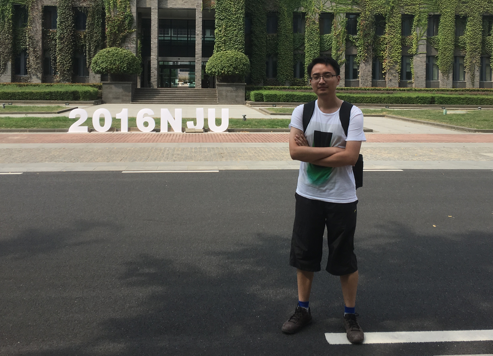

title: Yang Cao

# Yang Cao 曹阳

M. Sc student, Dept. Computer Science and Technology, Nanjing University

I received my B. Sc degree in Department of Computer Science and Technology from Nanjing University in July 2016. 
From then on, I am enrolled in the Graduate School of Nanjing University under the supervision of <a href="http://cs.nju.edu.cn/changxu/">Prof. Chang Xu</a>.

## Research

My research interests include software engineering and software methodology. 
And now, I'm focusing on symbolic execution and white-box fuzzing.

## Contact

<table>
<tr valign="top">
	<td align="right"><b>Email: </b></td><td></td>
</tr>
<tr valign="top">
	<td align="right"><b>GitHub: </b></td><td><a href="https://github.com/CyberOracle/">https://github.com/CyberOracle/</a></td>
</tr>
<tr valign="top">
	<td align="right"><b>Addr: </b></td><td>Yang Cao,  Department of Computer Science and Technology,  Nanjing University, 163 Xianlin Avenue,  Qixia District, Nanjing 210023, JiangSu, China.</td>
</tr>
</table>

Last Update: Oct 13, 2016
