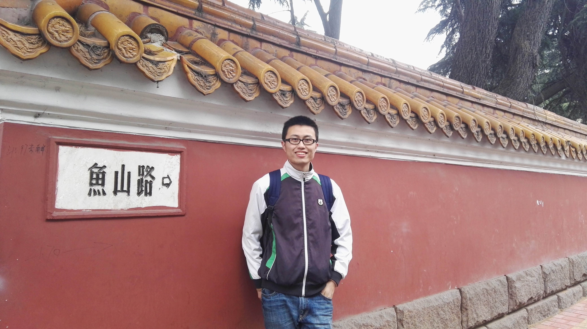

title: Yi Liu

# Yi Liu 刘毅 

M. Sc student, Department of Computer Science and Technology, Nanjing University.

I am supervised by [Prof. Xiaoxing Ma (马晓星)](http://moon.nju.edu.cn/people/xiaoxingma/) and [Prof. Chang Xu (许畅)](http://cs.nju.edu.cn/changxu/).

I received my B. Sc degree in Department of Computer Science and Technology from Nanjing University in July 2017.

## Research

My research interests focus on Android app testing.

**Publications**:

~~~{.bibtexhtml hl_lines="Yi Liu"}
@article{liu2018navydroid,
    author={Liu, Yi and Wang, Jue and Xu, Chang and Ma, Xiaoxing and L{\"u}, Jian},
    title={NavyDroid: An Efficient Tool of Energy Inefficiency Problem Diagnosis for Android Applications},
    journal={Science China Information Sciences},
    volume={61},
    pages={1--20},
    year={2018},
    publisher={Springer}
}
@inproceedings{liu2017navydroid,
    author={Liu, Yi and Wang, Jue and Xu, Chang and Ma, Xiaoxing},
    title={NavyDroid: Detecting Energy Inefficiency Problems for Smartphone Applications},
    booktitle={Proceedings of the 9th Asia-Pacific Symposium on Internetware},
    series={Internetware '17},
    year={2017},
    location={Shanghai, China},
    publicsher={ACM}
}
~~~

## Others

**Blog**: [nettee.github.io](http://nettee.github.io)

**GitHub**: nettee 

## Contact

**Email**: 

**Address**:

+ Room 812, Building of Computer Science and Technology
+ Department of Computer Science and Technology
+ Nanjing University (Xianlin Campus)
+ 163 Xianlin Avenue, Qixia District, Nanjing, Jiangsu, China (210023)
