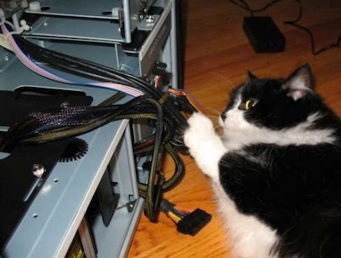
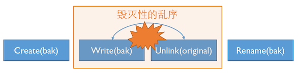
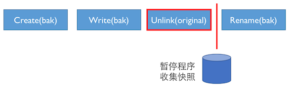
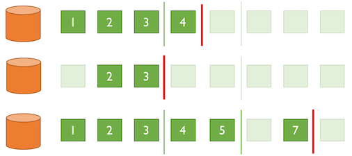
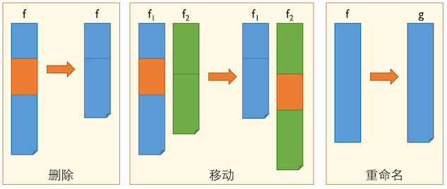

title: 你的程序真的正确保存了用户数据吗？

# 【FSE16论文介绍】你的程序真的正确保存了用户数据吗？

> 原文发表在FSE 2016，标题“Crash Consistency Validation Made Easy”。

## 我们解决什么问题？

先设想一个场景：你熬夜写完了论文，终于觉得可以喘一口气，然后舒舒服服地按下了`CTRL+S`保存文件。就在这时，你家的猫大爷拔掉了你的电源，你以前保存过的内容还在吗(图片来自网络)？

<center></center>

你肯定会想：这软件那么多用户，那么多专业的程序员，肯定没事吧？最多就是我最后没保存的几个错别字没改过来呗。

这可不一定哦！这个问题更学术一点的定义叫“崩溃一致性(crash consistency)”。这个概念最早出现在文件系统的研究中——文件系统是一个庞大的数据结构，而一个文件操作通常需要对数据结构的多个部分进行修改，因此在诸如断电、系统故障等情况下保持文件系统的一致性就成为了一个挑战。

之前的研究工作表明，无论是SSD硬件[2]、数据库系统[3]还是系统软件[4]，多少都有一些崩溃一致性的问题。连那么厉害的专业程序员、久经考验的开源和商业项目都没搞定的事情，想必遍地的新手程序员们也会犯类似的错误吧？你猜对了。

事实是，你的文本编辑器真的有可能摧毁你的文件。不仅文本编辑器有这个问题，相当多的其他类型的应用软件也存在这个问题。我们的论文就解决一个问题：

> **让检测应用程序崩溃一致性bug的过程尽量简单，简单到只要按一个键就可以了。**

## 从一个Bug例子说起

我是一名苦逼的程序员，为了养家糊口在外包公司做一个文本编辑器的项目。今天我完成的功能是存盘，在按下存盘键以后，将打开的文件保存。小case，我在Stackoverflow上搜索了“Java write file”，然后搞到了如下(简化的)代码：

```javascript
void writeTextFile(String path, String content) {
    PrintWriter writer = new PrintWriter(path);
    writer.write(content);
    writer.close();
}
```

作为一名优秀的程序员，我想了想这样好像不太对……万一在write的时候出了什么状况，用户的文件不就丢了么？所以最好先做个备份，肯定就万无一失了。于是我把代码改成了下面这样，跑完测试就愉快地回家逗猫玩了。

```java
void safelyWriteTextFile(String path, String content) {
    backupPath = path + ".tmp";
    writeTextFile(backupPath, content);
    deleteItem(path);
    renameItem(backupPath, path);
}
```

然而事情没那么简单。POSIX说，你确实是按照open -> write -> delete -> rename的顺序执行了操作，但我才没有规定从文件系统的角度看，它们是按照你执行的顺序完成的呢！什么？这意味着……

<center></center>

如果系统偷偷调换write和delete操作的顺序，并且在删除操写入磁盘后立即断电，那不就等于把用户的文件给删掉了么？也就是说，如果猫大爷真的在保存文件的时候拔掉了电源，这文件整个就没了啊(论文就没有了啊喂)！更可怕的是，现在的文件系统(比如默认设置下的ext4)因为只保留了元数据的日志而没有保存数据操作的日志，这样的“乱序”是真正能被观察到的[4, 5]！

这段代码来自文本编辑器Ted，所幸的是这个bug成功地被我们的工具检测到。
## 崩溃一致性的自动检测

现在我们有足够的动机去做一个工具检测应用程序的崩溃一致性了。对于程序猿来说，最好的工具就是拿来就能用的工具。所以我们的工具Crash Consistency Checker (C3)只需要被测程序的可执行文件和一个测试用例，方法大致分为3步(对技术细节没有兴趣的可以直接跳过)：

1. 运行一遍程序，取得我们认为对于应用来说“正确”的文件系统快照。
   > 什么是“正确”的快照呢？我们认为程序猿不会傻傻地把重要的用户文件删掉。所以，我们认为所有元数据操作执行完毕后，内存中的文件系统快照代表了程序猿定义的“正确”状态。实现上，我们用ptrace拦截程序发出的系统调用，并在系统调用结束后从内存中抓取快照。
   >
   > <center></center>
   >
   > 回到之前保存文件的例子，“正确”的快照中至少包含一个文件的内容。
2. 使用一个虚拟的磁盘捕获所有的I/O请求，然后生成可能的崩溃现场。
   > 实现上，我们写了一个ramdisk的驱动，它从外面看表现得和正常的磁盘一模一样，但在后台悄悄记录了所有I/O操作的内容。根据这些I/O操作，就可以生成在Linux设备驱动规约允许条件下的各种崩溃现场。
   >
   > <center></center>
   >
   > 对于之前保存文件的例子，我们将会得到原文件被删除、备份文件尚未写入的一个文件系统快照。
3. 对每个崩溃现场计算与“正确”文件系统快照的编辑距离，如果距离很大，那这个崩溃现场就看起来很可疑。
   > 两个文件系统快照的编辑距离定义为通过连续内容的删除/移动/重命名操作将一个快照变为另一个的最小次数。不过直接计算这个编辑距离是NP-Complete的，我们用了一些小技巧做了一个近似，求解一个它的上界。
   >
   > <center></center>
   >
   > 显然，对于一个没有任何数据的文件系统快照，是无法通过编辑操作变成一个有数据的“正确”快照的，自然就被报告为可疑的bug了。

## 实验结果

我们从两大类(命令行工具和生产力工具)挑选了总共25个应用，并对每个应用的一个简单测试用例进行了测试。结果是我们找到了14个崩溃一致性bug，其中11个是开发者先前未知的bug，让我们看一看：

|         名称         |   版本   |   后果   | 是否未知Bug |
| :----------------: | :----: | :----: | :-----: |
|      GNU Make      |  4.1   | 错误编译结果 |         |
|      GNU Zip       |  1.6   |  丢失数据  |   Yes   |
|       bzip2        | 1.0.6  |  丢失数据  |   Yes   |
| GNU Coreutils sort |  8.21  |  丢失数据  |   Yes   |
|        Perl        |  5.22  |  丢失数据  |   Yes   |
|   Python Shelve    | 2.7.11 | 数据库损坏  |   Yes   |
|        Gimp        | 2.8.14 |  丢失数据  |         |
|     CuteMarkEd     | 0.11.2 |  丢失数据  |   Yes   |
|      TeXMaker      |  4.5   |  丢失数据  |   Yes   |
|     TeXStudio      | 2.10.8 |  丢失数据  |   Yes   |
|        Ted         |  1.0   |  丢失数据  |   Yes   |
|       jEdit        | 5.1.0  |  丢失数据  |   Yes   |
|    GitHub Atom     | 1.5.3  |  丢失数据  |         |
|   Adobe Brackets   | 1.5.0  |  丢失数据  |   Yes   |

让我们简单看一下遇到的bug：对in-place的处理很容易出错。比如`sort F -o F`、用于兼容古老版本的功能就变成了有危险的操作，提供原地替换的perl也有类似的问题。gzip和bzip2犯了和之前例子类似的错误：在删除旧文件之前没有等待数据同步，从而导致了“压缩等于删除”的可能。各类生产力工具所犯的错误五花八门，保存文件的方式也各不相同，但很多都导致了同样的后果——数据丢失。最后，gmake的问题在于，在你运行的脚本(如gcc)崩溃后，目标文件的时间戳被更新，内容却损坏了，这样如果这个文件最后被直接打包，就可能会导致严重的后果。在惊讶于这么多程序都有这类bug的同时，我们也对剩下通过测试的应用提出表扬，比如著名的Vim和Emacs。

## 最后的提醒

* 小心处理你的文件。看了这么多血淋淋的例子，我想你以后在保存数据的时候也会格外小心了吧。
* 库函数的支持非常重要。在和开源社区交互的过程中，我们很高兴地看到很多库都开始提供安全的文件操作(例如Qt中的`QSaveFile`和GTK中的`g_file_replace`)。与此同时，更多的新兴平台则做得不够好。比如Atom的开发者意识到了这类bug，但Node.js却缺乏一个可移植的方案让他们能更好地避免这种问题。
* 留意崩溃一致性问题。gmake的例子警示我们，崩溃一致性问题不仅是那些保存数据的人需要关心的，也许哪天就悄悄地影响了你。**所以如果你觉得这篇文章很有趣，请转发它让更多的人能意识到这个问题的存在。**

---

**参考文献**

[1] Arpaci-Dusseau R H, Arpaci-Dusseau A C. *Operating Systems: Three Easy Pieces* (v0.91), Arpaci-Dusseau Books, 2015.

[2] Zheng M, Tucek J, Qin F, Lillibridge M. Understanding the robustness of SSDS under power fault. In *Proceedings of the USENIX Conference on File and Storage Technologies* (FAST), 271--284, 2013.

[3] Zheng M, Tucek J, Huang D, Qin F, Lillibridge M, Yang E S, Zhao B W, Singh S. Torturing databases for fun and profit. In *Proceedings of the Conference on Operating Systems Design and Implementation* (OSDI), 449--464, 2014.

[4] Pillai T S, Chidambaram V, Alagappan R, Al-Kiswany S, Arpaci-Dusseau A C, Arpaci-Dusseau R H. All file systems are not created equal: On the complexity of crafting crash-consistent applications. In *Proceedings of the Conference on Operating Systems Design and Implementation* (OSDI), 433--448, 2014.

[5] Yang J, Sar C, Engler D. EXPLODE: A lightweight, general system for finding serious storage system errors. In *Proceedings of the Conference on Operating Systems Design and Implementation* (OSDI), 131--146, 2006.

**论文信息**：“Crash consistency validation made easy”的[论文](http://moon.nju.edu.cn/spar/publication/jiang_crash_2016.pdf)、[会议报告](http://moon.nju.edu.cn/spar/publication/c3_talk.pdf)和[相关代码](http://jiangyy.github.io/c3/)。

**作者简介**：本文作者包括南京大学博士生[蒋炎岩](http://moon.nju.edu.cn/~jyy)、俄亥俄州立大学的博士生陈海骋和[秦锋](http://web.cse.ohio-state.edu/%7Eqin/)教授、南京大学的[许畅](http://cs.nju.edu.cn/changxu/)、[马晓星](http://cs.nju.edu.cn/xxm)和吕建教授。

