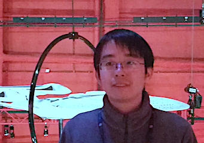

title: Yanyan Jiang

# Yanyan Jiang 蒋炎岩 

  

Ph.D. (*Nanjing University* , 2017)

I will join Nanjing University as an Assistant Researcher

I visited the *Ohio State University*  in 2015.

## Research

I'm a coder striving to make programming less miserable. I'm interested in technologies that can *automatically* make computer software better: *testing*, *analysis*, and *synthesis*. ([知乎专栏 ](https://zhuanlan.zhihu.com/se-research/) and chronological list of [my publications](pub).)

<ul>
  <li>**Software Testing and Analysis**</li>
  <ul>
    <li>Concurrent Programs: *Understanding Shared Memory Dependences* (CARE [[ICSE14](pubs/care)], RWTrace [[ASE15](pubs/rwtrace)], BC [[FSE16](pubs/bc)], Survey [[JoS17](pubs/survey)], and my [PhD Thesis](pubs/thesis));</li>
    <li>Mobile Apps: *Platform* (ATT [[Internetware15](pubs/att)], CoseDroid [[COMPSAC15](pubs/cosedroid)]); *Event Generation* (GAT [[APSEC16](pubs/gat)], AATT [[APSEC16](pubs/aatt), [SCP18](pubs/aattplus)]); *Leveraging Human Insights* (UGA [[APSEC14](pubs/uga)]); *Analysis* (RepDroid [[ICPC17](pubs/repdroid)]);</li>
    <li>Reliability: *Crash Consistency* (C3 [[FSE16](pubs/c3)]);</li>
    <li>Symbolic Analysis: *Fault Localization* (Comedy [[COMPSAC15](pubs/comedy)]);</li>
  </ul>
  <li>**Program Synthesis**</li>
  <ul>
    <li>*Transformers* (AOTES [[ICSE17 Poster](pubs/aotes)]);</li>
  </ul>
  <li>**Programming Tricks for Fun and Profits**</li>
  <ul>
    <li>*Software Building* (ABC [[APSEC15](pubs/abc)]); *Runtime Verification* (GAIN [[APSEC14](pubs/gain), [IST16](pubs/gain1)]).</li>
  </ul>
</ul>

## Teaching

* I am working on the *Project-N*  in which students build a complete computer system (NPC SoC, NEMU system emulator, Nanos operating system, NCC compiler, and applications) from scratch. I am the inventor of *Nanos* and *AbstractMachine* in Project-N, and contributed to the overall system-stack design.
    * We got Second Place in the 2017 Loongson Cup computer system design contest.
* Selected talks:
    * “计算：万物的起源和终点”  (Keynote speech at 2014 JSOI Winter Camp at Mudu high school).
    * “从逻辑门到电子计算机”  (Guest lecture for 2014 Introduction to Computer System at NJU).

## Services

*  Scientific Program Committee member of Jiangsu Olympiad in Informatics (the official programming contest hoster for high school students).
*  Coach of the programming contest training team at Nanjing University.

## Honors and Awards
* 2016 *Distinguished Student* of Nanjing University (the only PhD student out of ten winners).
* 2014 *MSRA Fellowship Award*; 2015 and 2010 *National Scholarship*;
* First Place in the 2014 Huawei Cup *Regional Programming Contest*; Second Place in the 2012 *Tencent Hackathon*.
* During my collegiate years, I competed in *ACM-ICPC* regional contests for two Gold Medals and earned 49th Place in the 2009 World Finals.

Last Update: December 11, 2017 

~~~{.customjs}
$('ul').css('margin-left', '-15px');
$('h2').css('margin-top', '15px');
$('h2').css('margin-bottom', '5px');
~~~
