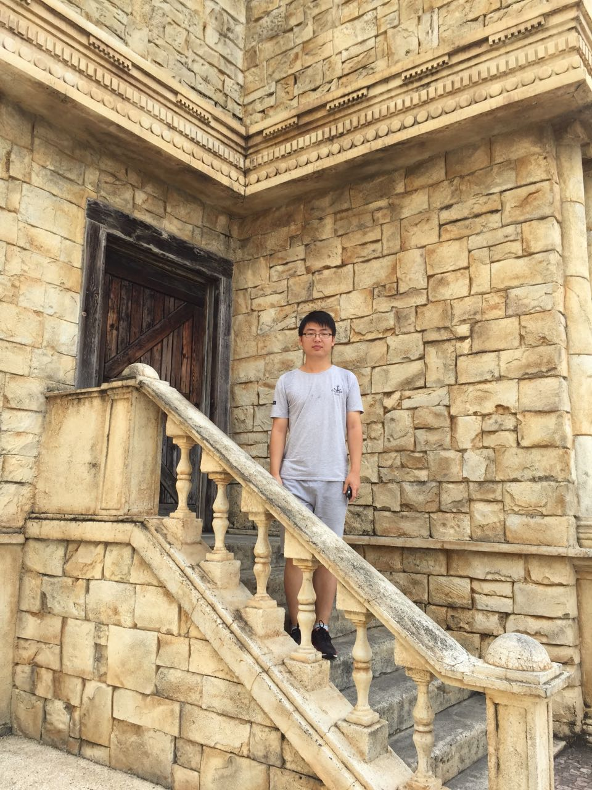

title: Zelin Zhao

# Zelin Zhao

* Institute of Computer Software, Nanjing University
* Room 812/813-4, Computer Science and Technology Building
* Email:
    * zelinzhao1105@gmail.com

## Biography

I received my B. Sc degree in Department of Computer Science and Technology from Nanjing University in July 2014. Now, I'm pursuing my Doctoral degree supervised by Prof. [Xiaoxing Ma](/people/xiaoxingma) and Prof. [Chang Xu](/people/changxu).

## Supervisor

* Professor [Xiaoxing Ma](/people/xiaoxingma)
* Professor [Chang Xu](/people/changxu)

## Research interests
My research interests include:

* Dynamic Software Updating
* Program Analysis
* Software Engineering

And now, I am doing some research on the automated patch generation for dynamic software update.

## Publications

~~~{.bibtexhtml hl_lines="Zelin Zhao"}
@inproceedings{gu_improving_2016,
  author    = {Tianxiao Gu and Zelin Zhao and Xiaoxing Ma and Chang Xu and Chun Cao and Jian L{\"u}},
  title     = {Improving reliability of dynamic software updating using runtime recovery},
  booktitle = {Proceedings of the 23rd Asia-Pacific Software Engineering Conference (APSEC)},
  pages     = {to appear},
  year      = {2016},
}

@inproceedings{zhao_cure_2016,
  author    = {Zelin Zhao and Tianxiao Gu and Xiaoxing Ma and Chang Xu and Jian L{\"u}},
  title     = {CURE: Automated patch generation for dynamic software update},
  booktitle = {Proceedings of the 23rd Asia-Pacific Software Engineering Conference (APSEC)},
  pages     = {to appear},
  year      = {2016},
}

@inproceedings{zhao_automated_2014,
    author = {Zhao, Zelin and Ma, Xiaoxing and Xu, Chang and Yang, Wenhua},
    title = {Automated Recommendation of Dynamic Software Update Points: An Exploratory Study},
    booktitle = {Proceedings of the 6th Asia-Pacific Symposium on Internetware on Internetware},
    year = {2014},
    location = {Hong Kong, China},
    pages = {136--144},
    numpages = {9},
    url = {http://doi.acm.org/10.1145/2677832.2677853},
    doi = {10.1145/2677832.2677853},
    pdf = {static/internetware-14.pdf},
}
~~~

## Teaching Assistant

* 2015 (Spring) Discrete Mathematics and Its Applications
* 2014 (Spring) Discrete Mathematics and Its Applications

## Other
##### Hobbies
* Football, Music, FPS Games
