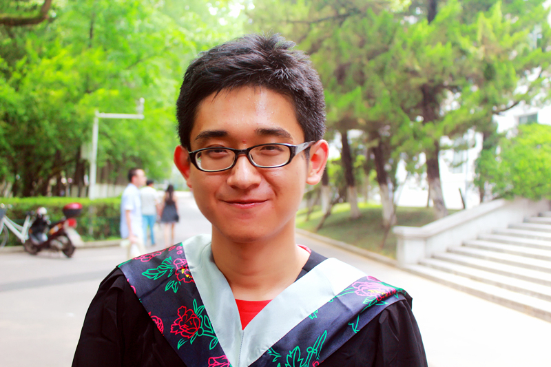

title: Zhanshuai Meng

# Zhanshuai Meng 孟占帅

<ul>
<li>[System and Program Analysis Group](/spar/)
<li>[Institute of Computer Software](http://moon.nju.edu.cn), [Nanjing University](http://www.nju.edu.cn)
<li>[Department of Computer Science and Technology](http://cs.nju.edu.cn), [Nanjing University](http://www.nju.edu.cn)
<li>Address: Room 824, Computer Science and Technology Building
<li>Email: mzsnanju(at)gmail dot com
<li>
  [<i class="fa fa-weibo"></i>](http://weibo.com/2181239377/profile?topnav=1&wvr=6 "http://weibo.com/2181239377/profile?topnav=1&wvr=6")
  [<i class="fa fa-sign-in"></i>](http://mengzs.com "http://www.mengzs.com")
</ul>

# Biography

* I received my B. Sc degree in Department of Computer Science and Technology from [Nanjing University](http://www.nju.edu.cn) in July 2015.
* I am supervised by [Prof. Xiaoxing Ma (马晓星)](http://moon.nju.edu.cn/people/xiaoxingma/) and [Prof. Chang Xu (许畅)](http://cs.nju.edu.cn/changxu/).

## Research

* My research interests focus on Mobile Application Testing and Analysis.

## Publication List

~~~{.bibtexhtml hl_lines="Zhanshuai Meng"}
@inproceedings{meng_facilitating_2015,
    title = {Facilitating Reusable and Scalable Automated Testing and Analysis for Android Apps},
    author = {Zhanshuai Meng and Yanyan Jiang and Chang Xu},
    year = {2015},
    booktitle = {Proceedings of the 7th Asia-Pacific Symposium on Internetware},
    location = {Wuhan, China},
    url = {http://dl.acm.org/citation.cfm?id=2875937},
    doi = {10.1145/2875913.2875937},
    pages = {166--175},
}
~~~

## Hobbies

* I am fond of reading before bed and I am good at billiards.
* I have kept on running and fitness since 2012.
* I am developing advanced techniques in photography for a few years.

## Honors and Awards

* Outstanding students of Nanjing University, Nov 2013
* Excellent Graduate Awards of Nanjing University, Jul 2015
