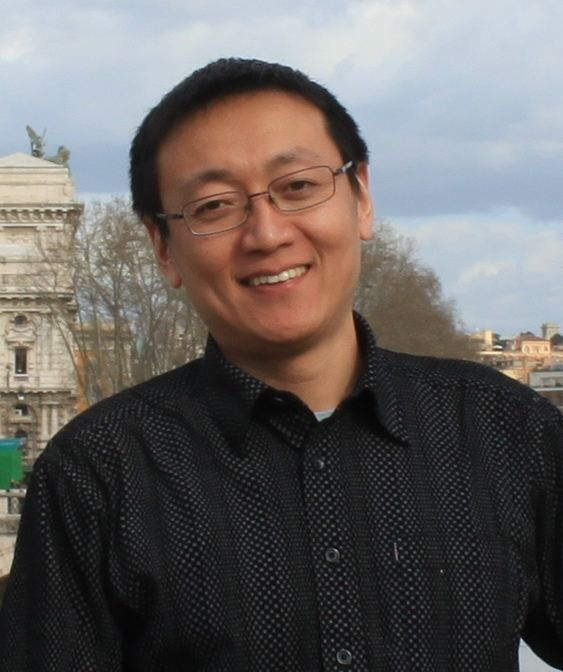

title: Xiaoxing Ma

English
<a href="cn/">中文</a>

<table border="0" cellpadding="0" cellspacing="0" width="100%">
    <tbody>
    <tr>
        <td valign="top" width="300"></td>
        <td valign="top">
            <table border="0" cellpadding="0" cellspacing="0">
                <tbody>
                <tr>
                    <td colspan="2">
                        Dr. Xiaoxing Ma
                    </td>
                </tr>
                <tr>
                    <td colspan="2">
                        Professor
                    </td>
                </tr>
                <tr>
                    <td colspan="2">
                        State Key Laboratory for Novel Software Technology, Nanjing University
                    </td>
                </tr>
                <tr>
                    <td colspan="2">
                        Department of Computer Science and Technology, Nanjing University
                    </td>
                </tr>
                <tr>
                    <td align="right" style="vertical-align:top;padding-top:10pt">Address:</td>
                    <td style="padding-left:15px;vertical-align:top;padding-top:10pt">
                        Department of Computer Science, 
                        Nanjing University Xianlin Campus (Mailbox 603) 
                        163 Xianlin Avenue, Qixia, Nanjing 210023, Jiangsu, China
                    </td>
                </tr>
                <tr>
                    <td align="right">Office:</td>
                    <td style="padding-left:15px">Computer Science and Technology Building 816</td>
                </tr>
                <tr>
                    <td align="right">Phone:</td>
                    <td style="padding-left:15px">+86 25 89686068</td>
                </tr>
                <tr>
                    <td align="right">Fax:</td>
                    <td style="padding-left:15px">+86 25 83593283</td>
                </tr>
                <tr>
                    <td align="right">Email:</td>
                    <td style="padding-left:15px"></td>
                </tr>
                </tbody>
            </table>
        </td>
    </tr>
    </tbody>
</table>

<!--
## Short biography
Dr. Xiaoxing Ma is a professor at the [[http://cs.nju.edu.cn][Department of Computer Science and Technology]], [[http://www.nju.edu.cn][Nanjing University]]. He got his B.Sc., M.Sc. and Ph.D., all in Computer Science, from the same University in 1997, 2000 and 2003, respectively. 

He worked as a Borsa Post-Doc in the [[http://deepse.dei.polimi.it/][DEEP-SE group]], [[http://www.polimi.it/][Politecnico di Milano]] from Dec. 2009 to Nov. 2010. He was once a research assistant in the [[http://www.comp.polyu.edu.hk/][Department of Computing]], [[http://www.polyu.edu.hk/][Hong Kong Polytechnic University]] from Oct. 2001 to Mar. 2002. 
-->

## Research interests

I am interested in various topics in software engineering, especially

* Adaptive software systems ( _newly funded by [NSFC](http://www.nsfc.gov.cn/): [ESEEPS](eseeps)_)
* Software architectures and middleware systems
* Service-oriented computing

## [Publications](publications)

* *[English publications](publications)*
* *[Chinese publications](http://www.cdblp.cn/search_result.php?author_name=%E9%A9%AC%E6%99%93%E6%98%9F&domain=computer)*

### Some recent publications:

{{ render_bib_file('selected.bib', hl='Xiaoxing Ma') }}

## Teaching
   * 2015, Spring: [Discrete Mathematics and Its Applications](http://moon.nju.edu.cn/courses/course/view.php?id=31) (Dept. CSE)
   * 2014, Autumn: [Discrete Mathematical Structures] (Inst. Softw.)
   * 2014, Spring: [Discrete Mathematics and Its Applications](http://moon.nju.edu.cn/courses/course/view.php?id=25) (Dept. CSE)
   * 2008-2014, Spring: [Concepts of Programming Languages](copl)
   * 2013, Autumn: [Discrete Mathematical Structures](DMS2013.html) (Inst. Softw.)
   * Before 2007:  [Object-Oriented Software Construction](OOT2007.html)

## Awards
   * 2006: China National Award for Science and Technology Progress, 2nd prize. Dr. Ma is the 2nd awardee of the team. （国家科技进步二等奖，第二完成人）
   * 2011: China National Award for Science and Technology Progress, 2nd prize. Dr. Ma is the 4th awardee of the team. （国家科技进步二等奖，第四完成人）
   * 2009: _CVIC SE_ Award for Software Researchers. （中创软件人才奖）
   * 2010: MOE Award for S&T Research in Universities, 1st class, Ministry of Education. I am the 2nd awardee of the team. （教育部高校优秀科研成果技术发明一等奖，第二完成人）

## Professional activities

* Member of program committees 
    * SEAMS [2016](http://seams2016.jgreen.de/), [2014](http://seams2014.uni-paderborn.de/), [2013](http://www.yorku.ca/mlitoiu/seams2013/), [2012](http://www.seams2012.cs.uvic.ca/): 9th/8th/7th International Symposium on Software Engineering for Adaptive and Self-Managing Systems
    * Internetware [2015 PC Co-Chair](http://internetware2015.trustie.net/), 2014
    * [SOSE 2013](http://sei.pku.edu.cn/conference/sose2013/): 7th International Symposium on Service Oriented System Engineering
    * [WICSA/ECSA 2012 - Joint 10th Working IEEE/IFIP Conference on Software Architecture & 6th European Conference on Software Architecture](http://www.wicsa.net/)
    * VINCI 2011, 2010, 2009: [Visual Information Communication - International Symposium](http://www.cse.ust.hk/vinci2011/)
    * SCORE 2011: [Student Contest on Software Engineering](http://score-contest.org/2011/)
    * [Software engineering education track of ICSE 2010](http://www.sbs.co.za/ICSE2010/3-EVENTS/_TRACKS/ICSE2010_SE-EDUCATION.html)
* Editorial Board Member 
    * [Journal of Software](http://www.jos.org.cn) (in Chinese), since Jan. 2011.
* Guest Editor 
    * Special Focus on Internetware, _Science China: Information Sciences_ Volume 56, Number 1, January 2013.
    * Special Focus on Self-adaptive Software Systems: Development Methods and Runtime Supports. _Journal of Software_ Volume 26, Number 4, April 2015.

